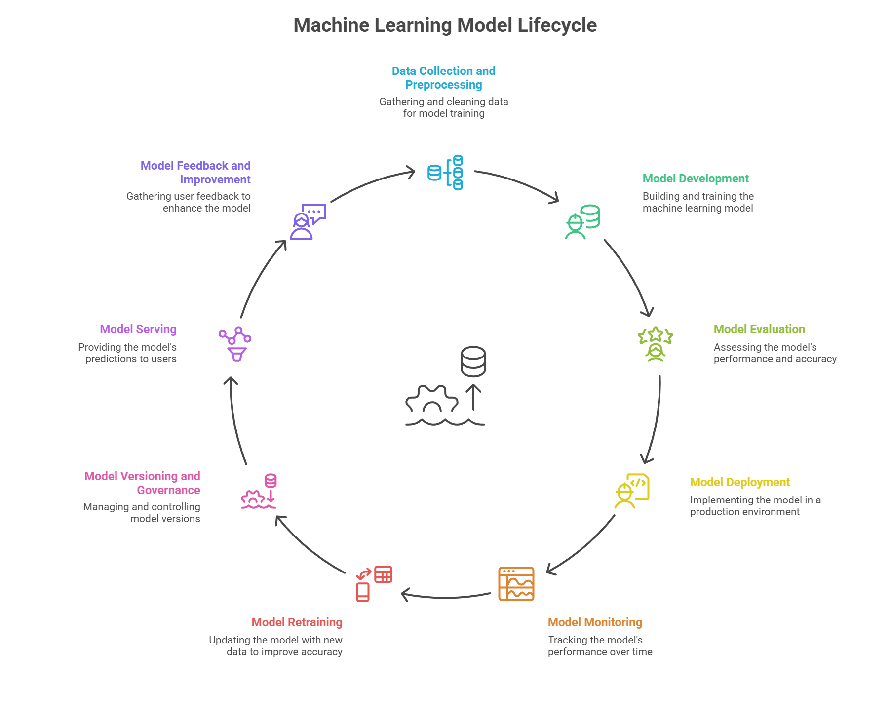

# MLops
An academic project involving the creation of an end-to-end application that integrates a machine learning model.


# MLOps Fraud Detection (IEEE-CIS)

End-to-end MLOps project:
- Data versioning: DVC (remote: DagsHub / S3 compatible)
- Experiment tracking + model registry: MLflow (DagsHub integrated)
- CI/CD: Jenkins
- Serving: FastAPI
- Deployment: Kubernetes (Kustomize overlays staging/prod)
- Validations: fast data checks (no EDA plots in pipeline)

## 1) Setup

### Create venv + install
```bash
python -m venv .venv
# Linux/Mac
source .venv/bin/activate
# Windows PowerShell
# .\.venv\Scripts\Activate.ps1

pip install -r requirements.txt
    